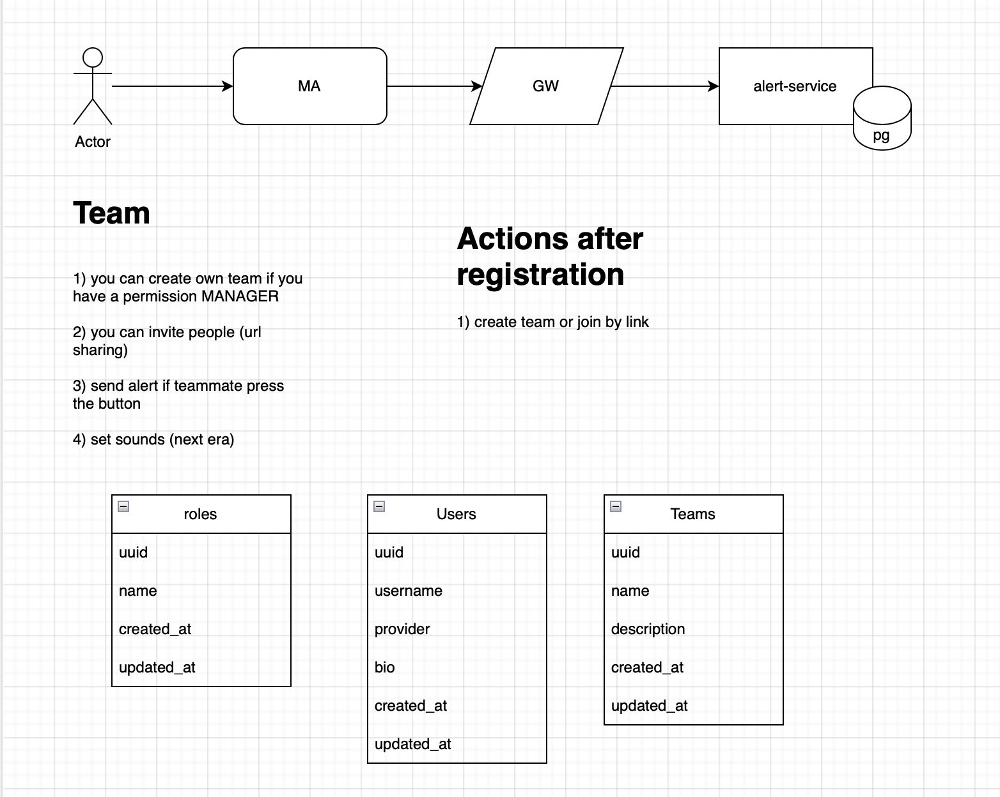

# alert-service

Now we don't have any description.

#### Version 0.0.1-SNAPSHOT

First iteration is small mvp with oauth2 + google and actions:
1. Create a new team. The team has an uuid which we can use with a "join" action.
2. Use an alert method, and we should send an event to firebase.
